<p align="center">
  
</p>

# Prasanna Saravanan


Precision engineering. Tooling ecosystems. Agent infrastructure. Systems over hype. Architecture over execution.

---

## Mission Panels

### Current Work

- TractionX — Venture intelligence OS  
- Kernel.dev — Agent tool runtime  
- Async Systems — Redis-backed pipelines  
- Autonomous Agents — Thesis-trained systems  

---

## Technical Stack

Python • FastAPI • Redis • Postgres  
Next.js • Tailwind  
OpenAI • TogetherAI • VertexAI • Qdrant

---

```bash
┌─[prasanna@systems]─[~]
└──╼ $ ./query --info

LIVE_SYSTEMS:
  → tractionx.ai          # Venture Intelligence OS
  → getkernel.dev         # Agent Tool Runtime

TRANSMIT_CHANNELS:
  → prasanna.page         # Personal Domain
  → linkedin/prasanna     # Professional Network  
  → x/@prasanna_builds    # Public Timeline
  → prasanna.builds       # Direct Contact

COMPETITIVE_RUNTIME:
  → leetcode/1QJrjkfcbd   # Algorithm Training

┌─[prasanna@systems]─[~]
└──╼ $ ./connect --establish
> Establishing secure connections...
> Protocol: HTTPS | Status: ACTIVE
> All systems operational ✓
```

<p align="center">
<a href="https://tractionx.ai">TractionX</a> · 
<a href="https://www.getkernel.dev">Kernel</a> · 
<a href="https://www.prasanna.page">Website</a> · 
<a href="https://www.linkedin.com/in/prasanna-saravanan">LinkedIn</a> · 
<a href="https://x.com/prasanna_builds">X</a> · 
<a href="mailto:prasanna.builds@gmail.com">Email</a> · 
<a href="https://leetcode.com/u/1QJrjkfcbd">LeetCode</a>
</p>

---

## Holopin Board

<div align="center">
  <a href="https://holopin.io/@prasnnasaravanan">
    
  </a>
</div>

---

## Contribution Graph

<div align="center">
  
</div>
