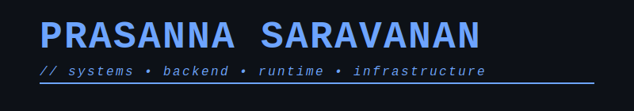

<p align="center">
  
</p>

# Prasanna Saravanan

Precision engineering. Tooling ecosystems. Agent infrastructure.  
Systems over hype. Architecture over execution.


## Current Work

```
╔══════════════════════════════════════════════════════════════════════════╗
║  ACTIVE MISSIONS                                                         ║
╠══════════════════════════════════════════════════════════════════════════╣
║                                                                          ║
║  → TractionX          Venture intelligence OS                            ║
║  → Kernel.dev         Agent tool runtime                                 ║
║  → Async Systems      Redis-backed pipelines                             ║
║  → Autonomous Agents  Thesis-trained systems                             ║
║                                                                          ║
╚══════════════════════════════════════════════════════════════════════════╝
```

```
════════════════════════════════════════════════════════════════════════════════════
```

## OSS Log

<div align="center">
  <a href="https://holopin.io/@prasnnasaravanan">
    
  </a>
</div>

```
════════════════════════════════════════════════════════════════════════════════════
```

## Technical Stack

```
STACK_TREE v2.1.0
│
├─ Backend & Infrastructure
│  ├─ Languages ──────┬─ Python
│  │                  ├─ TypeScript
│  │                  └─ Node.js
│  │
│  ├─ Frameworks ─────┬─ FastAPI
│  │                  └─ Express
│  │
│  ├─ Databases ──────┬─ PostgreSQL
│  │                  ├─ Redis
│  │                  └─ Qdrant (Vector)
│  │
│  └─ Async/Queue ────┬─ Celery
│                     ├─ Redis Queue
│                     └─ Background Workers
│
├─ Frontend & UI
│  ├─ Framework ──────── Next.js 14 (App Router)
│  ├─ Styling ────────┬─ Tailwind CSS
│  │                  ├─ Radix UI
│  │                  └─ shadcn/ui
│  ├─ Animation ──────┬─ Framer Motion
│  │                  └─ Anime.js
│  └─ State ──────────┬─ Zustand
│                     └─ React Context
│
├─ AI & Machine Learning
│  ├─ LLMs ───────────┬─ OpenAI GPT-4
│  │                  └─ Claude (Anthropic)
│  ├─ Inference ──────┬─ Together AI
│  │                  └─ Vertex AI (Google)
│  ├─ Embeddings ─────┬─ OpenAI
│  │                  └─ Voyage AI
│  ├─ Vector Store ──── Qdrant
│  └─ Frameworks ─────┬─ LangChain
│                     └─ Custom Pipelines
│
├─ DevOps & Deployment
│  ├─ Hosting ────────┬─ Vercel (Frontend)
│  │                  ├─ Render (Backend)
│  │                  └─ Railway (Backend)
│  ├─ Containers ─────┬─ Docker
│  │                  └─ Docker Compose
│  ├─ CI/CD ──────────── GitHub Actions
│  └─ Monitoring ─────┬─ Sentry
│                     └─ Custom Logging
│
└─ Development Tools
   ├─ Version ────────┬─ Git
   │                  └─ GitHub
   ├─ Editor ─────────┬─ Cursor
   │                  ├─ VS Code
   │                  └─ Vim
   ├─ API Testing ────┬─ Postman
   │                  └─ Thunder Client
   └─ Prototyping ────┬─ Jupyter
                      └─ Python REPL
```

<br>

## Live Systems & Network

```bash
prasanna@systems:~$ ./deploy --list

┌──────────────────────────────────────────────────────────────────┐
│ PRODUCTION DEPLOYMENTS                                           │
├──────────────────────────────────────────────────────────────────┤
│                                                                  │
│  [LIVE] tractionx.ai         → Venture Intelligence OS           │
│  [LIVE] getkernel.dev        → Agent Tool Runtime                │
│                                                                  │
└──────────────────────────────────────────────────────────────────┘

prasanna@systems:~$ ./connect --all

┌──────────────────────────────────────────────────────────────────┐
│ NETWORK PROTOCOLS                                                │
├──────────────────────────────────────────────────────────────────┤
│                                                                  │
│  DOMAIN      → prasanna.page                                     │
│  SOCIAL      → linkedin.com/in/prasanna-saravanan                │
│  STREAM      → x.com/prasanna_builds                             │
│  MAIL        → prasanna.builds@gmail.com                         │
│  COMPETE     → leetcode.com/u/1QJrjkfcbd                         │
│                                                                  │
└──────────────────────────────────────────────────────────────────┘

prasanna@systems:~$ status
> All systems operational ✓
> Connections established
> Ready to receive
```

<div align="center">

**[TractionX](https://tractionx.ai)** • **[Kernel](https://www.getkernel.dev)** • **[Website](https://www.prasanna.page)** • **[LinkedIn](https://www.linkedin.com/in/prasanna-saravanan)** • **[X](https://x.com/prasanna_builds)** • **[Email](mailto:prasanna.builds@gmail.com)** • **[LeetCode](https://leetcode.com/u/1QJrjkfcbd)**

</div>

## Contribution Matrix

<div align="center">
  
</div>

<div align="center">

```
════════════════════════════════════════════════════════════════════════════════════
                                EOF — SYSTEMS ONLINE
════════════════════════════════════════════════════════════════════════════════════
```

</div>
