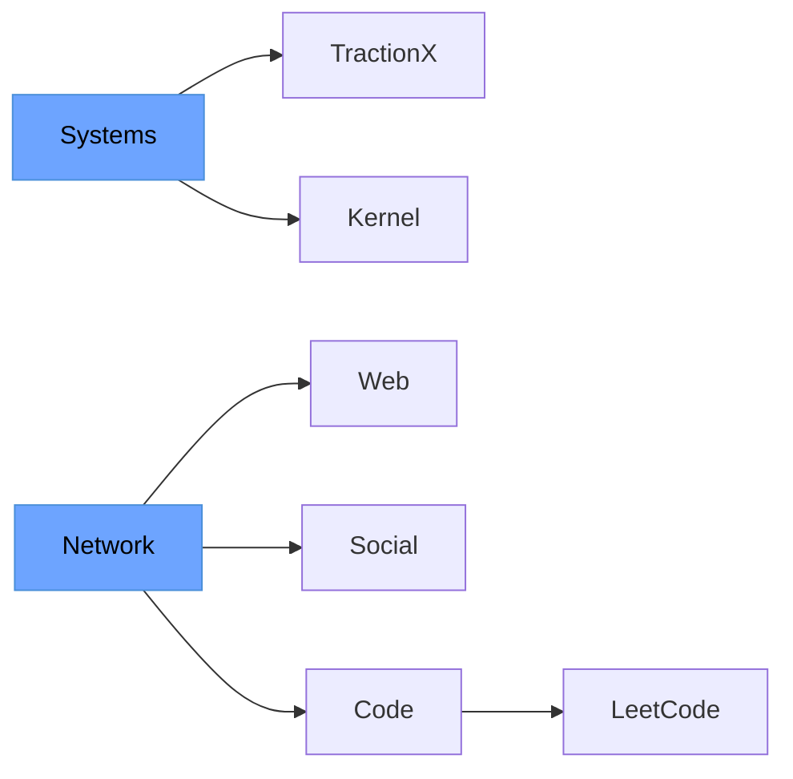

<p align="center">
  
</p>

# Prasanna Saravanan

### AI Systems Architect

Precision engineering. Tooling ecosystems. Agent infrastructure.  
Systems over hype. Architecture over execution.

---

## Mission Panels

### Current Work

- TractionX — Venture intelligence OS  
- Kernel.dev — Agent tool runtime  
- Async Systems — Redis-backed pipelines  
- Autonomous Agents — Thesis-trained systems  

---

## Technical Stack

Python • FastAPI • Redis • Postgres  
Next.js • Tailwind  
OpenAI • TogetherAI • VertexAI • Qdrant

---

## Network Graph

<table width="100%">
<tr>
<td width="50%" valign="top">

<br>

## Live Systems

```bash
$ ./systems --status
> Initializing production endpoints...
> Status: ONLINE
```

<br>

### **[TractionX](https://tractionx.ai/)**
Venture Intelligence OS

<br>

### **[Kernel](https://www.getkernel.dev/)**
Agent Tool Runtime

<br>

</td>
<td width="50%" valign="top">

<br>

## Transmit Channels

```bash
$ ./connect --all
> Establishing network connections...
> Ready: 4 channels
```

<br>

### **[Website](https://www.prasanna.page)**
prasanna.page

### **[LinkedIn](https://www.linkedin.com/in/prasanna-saravanan/)**
Professional Network

### **[X](https://x.com/prasanna_builds)**
@prasanna_builds

### **[Email](mailto:prasanna.builds@gmail.com)**
prasanna.builds

<br>

</td>
</tr>
</table>

<div align="center">



**[Competitive Runtime](https://leetcode.com/u/1QJrjkfcbd/)** · LeetCode Profile

</div>

---

## Holopin Board

<div align="center">
  <a href="https://holopin.io/@prasnnasaravanan">
    
  </a>
</div>

---

## Contribution Graph

<div align="center">
  
</div>
